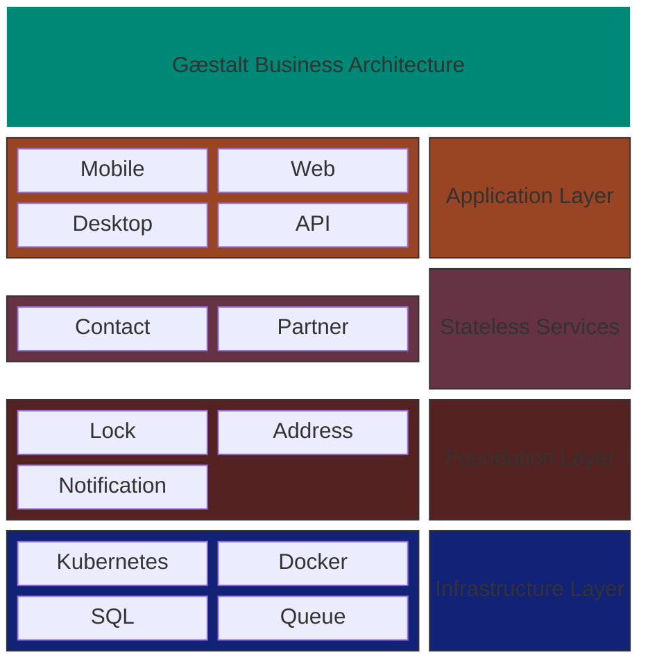

<picture>
  <source media="(prefers-color-scheme: dark)" srcset="gaestaltlogo-dark.png">
  <source media="(prefers-color-scheme: light)" srcset="gaestaltlogo-light.png">
  
</picture>

Gæstalt accelerates the creation of enterprise applications within medium- to large-scale
organizations. Gæstalt is a toolkit of components, each of which can be used independently
or in conjunction with the other components in the

The Gæstalt system covers all the key business areas needed for most businesses, 
including core concepts such as customer and supporting functions such as notification
and address validation. 

Gæstalt is written in part with agentic agents in mind. One goal of the project is to have 
components that are well document and easy to reason about for both human and agentic 
programmers.

## Systems

| System | Description | Status |
|--------|-------------|--------|
| [contact](contact/) | Contact management service with gRPC/REST APIs and Kafka consumers | Active |
| [partner](partner/) | Manages configuration values and attributes for partners | Future |
| [address](address/) | Wrapper service for address validation services, supporting internation addresses and sophisticated usage based routing | Active |
| [notification](notification/) | Wrapper service for notification services - email, sms | Future |
| [lock](lock/) | Distributed lock manager with Raft consensus and cross-region quorum | Active |

## Structure

```
gaestalt/
├── address/           # Address validation service
│   ├── format/
│   ├── format/ca
│   ├── format/gb
│   ├── format/us
│   ├── grpc
│   ├── provider
│   ├── provider/routing
│   ├── provider/smarty
│   ├── provider/usps
│   ├── service
├── contact/           # Contact management service
│   ├── contact-api/
│   ├── contact-common/
│   ├── contact-consumer-ids/
│   ├── contact-consumer-address/
│   ├── helm/
│   ├── k8s/
│   └── terraform/
├── lock/             # Distributed lock manager
│   ├── src/
│   ├── helm/
│   └── Dockerfile
└── (future systems)
```

## Design Principles

- **Independent builds**: Each system has its own parent POM and builds independently
- **Independent deployments**: Each system produces its own Docker images and Kubernetes resources
- **Shared nothing**: Systems communicate via APIs and messaging, not shared libraries
- **Docker context per system**: Each system's Dockerfile context is its own directory

## Architecture




## TODO

- [ ] Migrate Kafka from Zookeeper to KRaft mode (Kafka 3.3+ supports Zookeeper-free operation via KRaft consensus). Update `k8s/kafka.yaml`, `test-data/docker-compose.yml`, and Helm charts to remove Zookeeper dependency.
- [x] contact-consumer-ids is a post-insert event processor. Standardize naming around these
- [x] address-validation: move completely to address service. 
- [ ] Add post-insert event processor for address validation in contact
- [ ] finalize partitioning strategy in contact system
- [x] move FeistelFPE to contact-consumer-ids
- [ ] split OAuth capabilities out of address into common library
- [ ] support additional address providers
- [ ] build native address cleansing capability
- [ ] check for non-streaming code & replace
