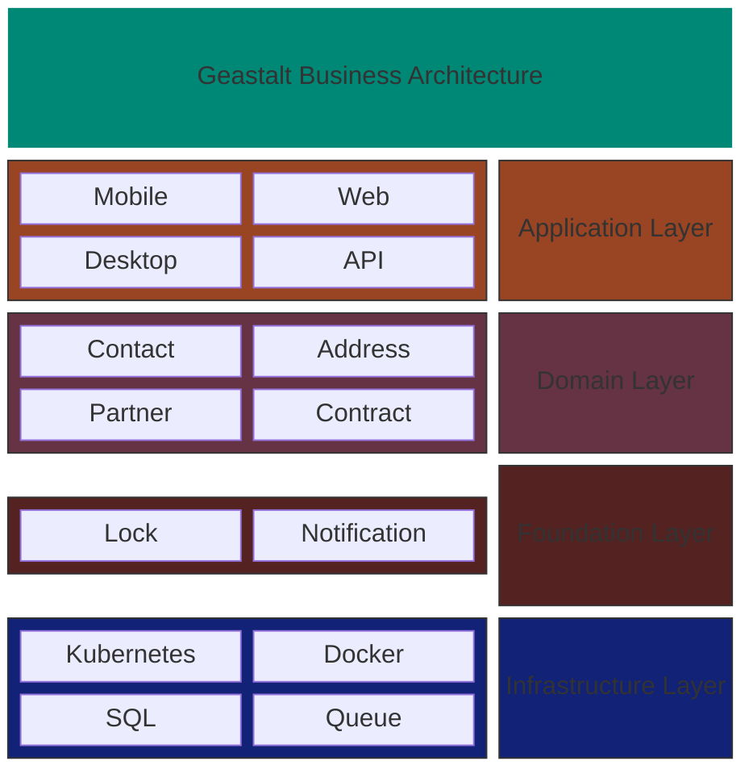

# Geastalt

<picture>
  <source media="(prefers-color-scheme: dark)" srcset="geastaltlogo-dark.png">
  <source media="(prefers-color-scheme: light)" srcset="geastaltlogo-light.png">
  
</picture>

Geastalt accelerates the creation of business applications within medium- to large-scale
organizations, and is built with concepts from web-scale application building on top 
of an enterprise architecture model for internal applications.

The geastalt system covers all the key business areas needed for most businesses, 
including core concepts such as customer and supporting functions such as notification
and address validation. 

## Systems

| System | Description | Status |
|--------|-------------|--------|
| [address](address/) | Address validation consumer using USPS API | Active |
| [contact](contact/) | Contact management service with gRPC/REST APIs and Kafka consumers | Active |
| [lock](lock/) | Distributed lock manager with Raft consensus and cross-region quorum | Active |

## Structure

```
geastalt/
├── address/          # Address validation consumer
│   ├── src/
│   ├── helm/
│   └── Dockerfile
├── contact/          # Contact management system
│   ├── contact-api/
│   ├── contact-common/
│   ├── contact-consumer-ids/
│   ├── helm/
│   ├── k8s/
│   └── terraform/
├── lock/             # Distributed lock manager
│   ├── src/
│   ├── helm/
│   └── Dockerfile
└── (future systems)
```

## Design Principles

- **Independent builds**: Each system has its own parent POM and builds independently
- **Independent deployments**: Each system produces its own Docker images and Kubernetes resources
- **Shared nothing**: Systems communicate via APIs and messaging, not shared libraries
- **Docker context per system**: Each system's Dockerfile context is its own directory

## Architecture


