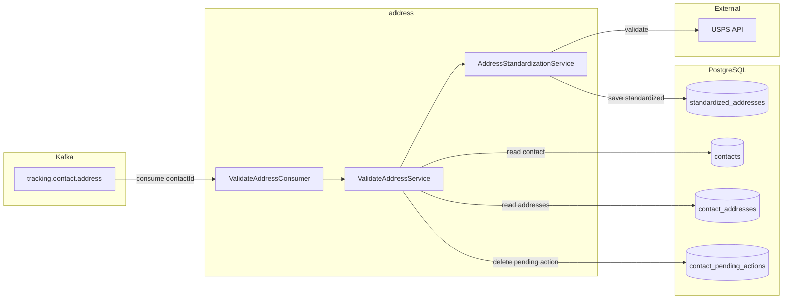
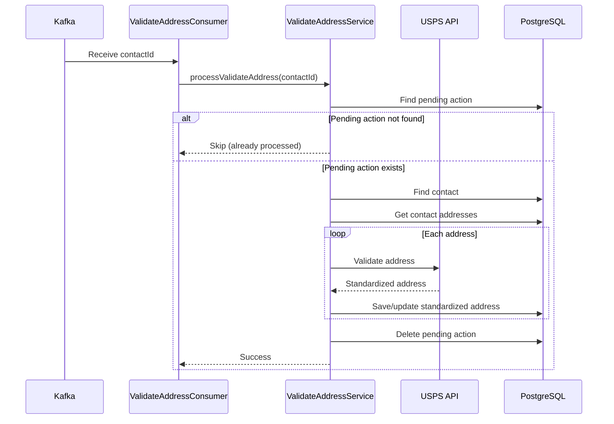

# Address Validation Consumer

Kafka consumer service that processes `VALIDATE_ADDRESS` pending actions using the USPS API.

## Overview

This service listens to the `tracking.contact.address` Kafka topic and validates/standardizes addresses for contacts using the USPS Address Validation API. It operates as an independent module that shares the contact database.

## Port

| Protocol | Port | Description |
|----------|------|-------------|
| HTTP | 9011 | Health endpoints |

## Architecture



## Processing Flow



## Processing Logic

1. **Receive message** from `tracking.contact.address` topic
2. **Check pending action** exists for the contact
3. **Verify contact** exists in database
4. **Retrieve all addresses** for the contact
5. **For each address**:
   - Build USPS request from current address data
   - Call USPS API to get standardized address
   - Save standardized address (or reuse existing if identical)
   - Update contact address to point to the USPS-standardized address
6. **Remove pending action** from `contact_pending_actions` table

## Configuration

```yaml
spring:
  kafka:
    bootstrap-servers: ${KAFKA_BOOTSTRAP_SERVERS:localhost:9092}
    consumer:
      group-id: ${KAFKA_CONSUMER_GROUP_ID:address-consumer}
      auto-offset-reset: earliest
      enable-auto-commit: false
    listener:
      ack-mode: manual

usps:
  base-url: ${USPS_BASE_URL:https://apis-tem.usps.com}
  client-id: ${USPS_CLIENT_ID}
  client-secret: ${USPS_CLIENT_SECRET}

address:
  kafka:
    topics:
      validate-address: ${PENDING_ACTION_TOPIC_VALIDATE_ADDRESS:tracking.contact.address}
```

## Environment Variables

| Variable | Description | Default |
|----------|-------------|---------|
| `KAFKA_BOOTSTRAP_SERVERS` | Kafka broker addresses | `localhost:9092` |
| `KAFKA_CONSUMER_GROUP_ID` | Consumer group ID | `address-consumer` |
| `PENDING_ACTION_TOPIC_VALIDATE_ADDRESS` | Topic to consume | `tracking.contact.address` |
| `USPS_BASE_URL` | USPS API base URL | `https://apis-tem.usps.com` |
| `USPS_CLIENT_ID` | USPS OAuth client ID | Required |
| `USPS_CLIENT_SECRET` | USPS OAuth client secret | Required |
| `DB_HOST` | Database host | `192.168.1.17` |
| `DB_PORT` | Database port | `5432` |
| `DB_NAME` | Database name | `contact` |
| `DB_USERNAME` | Database username | `bob` |
| `DB_PASSWORD` | Database password | Required |

## Building

```bash
# From address/ directory
cd address
mvn clean package -DskipTests

# Build Docker image
docker build -t address:latest .
```

## Running

```bash
# With Maven
mvn spring-boot:run

# With Java
java -jar target/address-0.0.1-SNAPSHOT.jar

# With Docker
docker run -p 9011:9011 \
  -e KAFKA_BOOTSTRAP_SERVERS=kafka:9092 \
  -e USPS_CLIENT_ID=your-client-id \
  -e USPS_CLIENT_SECRET=your-client-secret \
  -e DB_PASSWORD=your-password \
  address:latest
```

## Health Endpoints

| Endpoint | Description |
|----------|-------------|
| `/actuator/health` | Overall health status |
| `/actuator/health/liveness` | Kubernetes liveness probe |
| `/actuator/health/readiness` | Kubernetes readiness probe |

## Integration Point

Contact service publishes to Kafka topic `tracking.contact.address`; this module consumes from that same topic. No direct service-to-service API calls.

## Shared Database

This module connects to the same PostgreSQL database as the contact service. Tables used:
- `contacts` (read-only)
- `contact_addresses` (read/write)
- `standardized_addresses` (read/write)
- `contact_pending_actions` (read/delete)

## Scaling

- Default: 2 replicas in Kubernetes
- Kafka partitions determine max parallelism
- Each replica joins the same consumer group for load balancing
- Consider USPS API rate limits when scaling

## USPS Integration

The service uses the USPS Web Tools API for address standardization:

- **OAuth Authentication**: Tokens are cached and refreshed automatically
- **Address Validation**: Corrects and standardizes addresses
- **Deduplication**: Existing standardized addresses are reused
