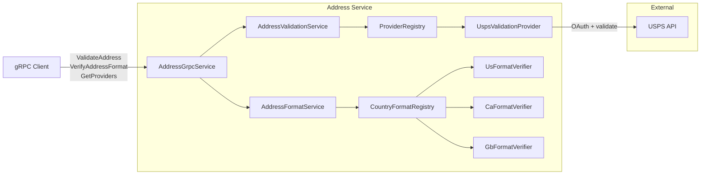

# Address Validation Service

Stateless gRPC facade for address validation and format verification. Routes addresses to the appropriate validation provider (USPS for US, extensible for other countries) and returns standardized results.

## Overview

This service accepts postal addresses via gRPC, validates them against external providers, and verifies address formatting for supported countries. It has no database and no Kafka dependencies — it is a pure validation facade.

## Ports

| Protocol | Port | Description |
|----------|------|-------------|
| gRPC | 9010 | Address validation API |
| HTTP | 9011 | Health/management endpoints |

## Architecture



## gRPC API

### ValidateAddress

Validates an address using the appropriate provider for the country.

```protobuf
rpc ValidateAddress(ValidateAddressRequest) returns (ValidateAddressResponse);
```

Response statuses: `VALIDATED`, `VALIDATED_WITH_CORRECTIONS`, `INVALID`, `PROVIDER_UNAVAILABLE`, `PROVIDER_ERROR`

### VerifyAddressFormat

Verifies address format (postal code, state/province codes, required fields) without calling an external provider.

```protobuf
rpc VerifyAddressFormat(VerifyAddressFormatRequest) returns (VerifyAddressFormatResponse);
```

Supported countries: US, CA, GB

### GetProviders

Lists available validation providers and their supported countries.

```protobuf
rpc GetProviders(GetProvidersRequest) returns (GetProvidersResponse);
```

## Address Model

Uses an international postal address model:

| Field | Description |
|-------|-------------|
| `country_code` | ISO 3166-1 alpha-2 (e.g., "US", "CA", "GB") |
| `address_lines` | Repeated street address lines |
| `locality` | City/town |
| `administrative_area` | State/province/region |
| `postal_code` | ZIP/postal code |
| `sub_locality` | District/suburb (optional) |
| `sorting_code` | Sorting code (optional) |
| `organization` | Organization name (optional) |
| `recipient` | Recipient name (optional) |

## Provider Architecture

Validation providers implement a common interface and are auto-discovered by Spring:

```
provider/
├── ValidationProvider.java          # Interface
├── ValidationRequest.java           # Internal model
├── ValidationResult.java            # Internal model
├── ProviderRegistry.java            # Routes by country code
└── usps/
    ├── UspsValidationProvider.java   # USPS API integration
    ├── UspsOAuthService.java         # OAuth2 token management
    ├── UspsConfig.java               # USPS configuration
    └── Usps*Request/Response.java    # USPS DTOs
```

Country-to-provider defaults are configured in `application.yml`:

```yaml
address:
  providers:
    defaults: "{US: usps}"
```

## Format Verification

Format verifiers validate address formatting without calling external APIs:

| Country | Postal Code | Admin Area | Notes |
|---------|-------------|------------|-------|
| US | `12345` or `12345-6789` | 50 states + DC + territories | All fields required |
| CA | `K1A 0B1` | 13 provinces/territories | All fields required |
| GB | Various UK patterns | Not required | Postcode + locality required |

## Configuration

```yaml
grpc:
  server:
    port: 9010
    reflection-service-enabled: true

usps:
  base-url: ${USPS_BASE_URL:https://apis-tem.usps.com}
  client-id: ${USPS_CLIENT_ID}
  client-secret: ${USPS_CLIENT_SECRET}

address:
  providers:
    defaults: "{US: usps}"
```

## Environment Variables

| Variable | Description | Default |
|----------|-------------|---------|
| `USPS_BASE_URL` | USPS API base URL | `https://apis-tem.usps.com` |
| `USPS_CLIENT_ID` | USPS OAuth client ID | Required |
| `USPS_CLIENT_SECRET` | USPS OAuth client secret | Required |

## Building

```bash
# From address/ directory
cd address
mvn clean package -DskipTests

# Build Docker image
docker build -t address:latest .
```

## Testing

```bash
# List services
grpcurl -plaintext localhost:9010 list

# Validate a US address
grpcurl -plaintext -d '{
  "address": {
    "country_code": "US",
    "address_lines": ["123 Main St"],
    "locality": "Springfield",
    "administrative_area": "IL",
    "postal_code": "62704"
  }
}' localhost:9010 com.geastalt.address.grpc.AddressService/ValidateAddress

# Verify address format
grpcurl -plaintext -d '{
  "address": {
    "country_code": "US",
    "address_lines": ["123 Main St"],
    "locality": "Springfield",
    "administrative_area": "IL",
    "postal_code": "62704"
  }
}' localhost:9010 com.geastalt.address.grpc.AddressService/VerifyAddressFormat

# List providers
grpcurl -plaintext -d '{}' localhost:9010 com.geastalt.address.grpc.AddressService/GetProviders
```

## Health Endpoints

| Endpoint | Description |
|----------|-------------|
| `/actuator/health` | Overall health status |
| `/actuator/health/liveness` | Kubernetes liveness probe |
| `/actuator/health/readiness` | Kubernetes readiness probe |
