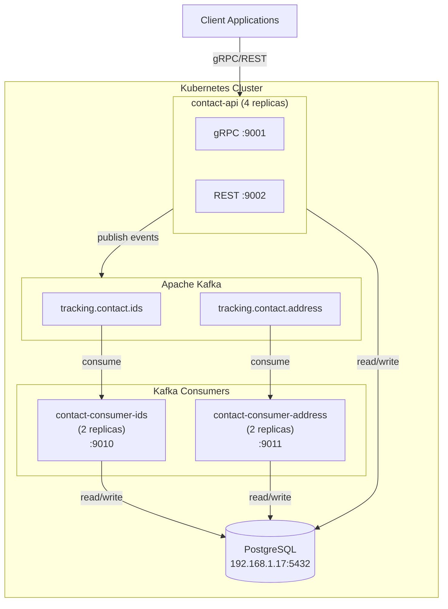
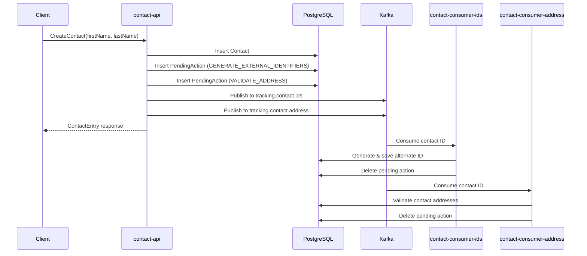

# Contact Service

A multi-module Spring Boot application providing contact management capabilities via gRPC and REST APIs, with Kafka-based event processing for asynchronous operations.

## Architecture



## Project Structure

```
contact/
├── pom.xml                          # Parent POM
├── contact-common/                   # Shared entities, repositories, services
├── contact-api/                      # gRPC and REST API service
├── contact-consumer-ids/             # Kafka consumer: Generate External IDs
├── contact-consumer-address/         # Kafka consumer: Validate Address
├── helm/                            # Kubernetes Helm charts
│   ├── contact-api/
│   ├── contact-consumer-ids/
│   └── contact-consumer-address/
├── k8s/                             # Kubernetes manifests
└── terraform/                       # Infrastructure as Code
```

## Modules

| Module | Description | Port |
|--------|-------------|------|
| `contact-common` | Shared entities, repositories, DTOs, and services | N/A (library) |
| `contact-api` | gRPC and REST API endpoints for contact operations | 9001 (gRPC), 9002 (REST) |
| `contact-consumer-ids` | Processes `GENERATE_EXTERNAL_IDENTIFIERS` pending actions | 9010 |
| `contact-consumer-address` | Processes `VALIDATE_ADDRESS` pending actions | 9011 |

## Event Flow



## Building

```bash
# Build all modules
mvn clean package -DskipTests

# Build specific module with dependencies
mvn clean package -DskipTests -pl contact-common,contact-api -am
```

## Docker Images

```bash
# Build from project root
docker build -f contact-api/Dockerfile -t contact-api:latest .
docker build -f contact-consumer-ids/Dockerfile -t contact-consumer-ids:latest .
docker build -f contact-consumer-address/Dockerfile -t contact-consumer-address:latest .
```

## Local Development

### Prerequisites

- Java 21
- Maven
- Docker
- Minikube (for Kubernetes deployment)
- PostgreSQL database at 192.168.1.17:5432
- Kafka at localhost:9092

### Running Locally

```bash
# Start contact-api
cd contact-api
mvn spring-boot:run

# Start consumers (in separate terminals)
cd contact-consumer-ids
mvn spring-boot:run

cd contact-consumer-address
mvn spring-boot:run
```

### Testing gRPC Endpoints

```bash
# List available methods
grpcurl -plaintext localhost:9001 list com.geastalt.contact.grpc.ContactService

# Create a contact
grpcurl -plaintext -d '{"first_name": "John", "last_name": "Doe"}' \
  localhost:9001 com.geastalt.contact.grpc.ContactService/CreateContact

# Get contact by ID
grpcurl -plaintext -d '{"contact_id": 11780449}' \
  localhost:9001 com.geastalt.contact.grpc.ContactService/GetContactById

# Search contacts
grpcurl -plaintext -d '{"last_name": "smith", "max_results": 25}' \
  localhost:9001 com.geastalt.contact.grpc.ContactService/SearchContacts

# Check pending action
grpcurl -plaintext -d '{"contact_id": 123, "action_type": "GENERATE_EXTERNAL_IDENTIFIERS"}' \
  localhost:9001 com.geastalt.contact.grpc.ContactService/HasPendingAction

# Create a plan
grpcurl -plaintext -d '{"plan_name": "Gold Plan", "carrier_id": 1, "carrier_name": "Aetna"}' \
  localhost:9001 com.geastalt.contact.grpc.ContactService/CreatePlan

# Get all plans
grpcurl -plaintext -d '{}' \
  localhost:9001 com.geastalt.contact.grpc.ContactService/GetPlans

# Add plan to contact (dates in ISO 8601 UTC)
grpcurl -plaintext -d '{"contact_id": 11780449, "plan_id": 1, "effective_date": "2026-01-01T00:00:00Z", "expiration_date": "2026-12-31T23:59:59Z"}' \
  localhost:9001 com.geastalt.contact.grpc.ContactService/AddContactPlan

# Get current plan for a contact
grpcurl -plaintext -d '{"contact_id": 11780449}' \
  localhost:9001 com.geastalt.contact.grpc.ContactService/GetCurrentContactPlan
```

## Kubernetes Deployment

### Deploy Kafka

```bash
kubectl apply -f k8s/kafka.yaml
```

### Create Secrets

```bash
# For contact-api
kubectl create secret generic external-fpe-key-secret \
  --from-literal=DB_PASSWORD=xxx \
  --from-literal=USPS_CLIENT_ID=xxx \
  --from-literal=USPS_CLIENT_SECRET=xxx

# For contact-consumer-ids
kubectl create secret generic contact-consumer-ids-secret \
  --from-literal=DB_PASSWORD=xxx \
  --from-literal=CONTACT_EXTERNAL_ID_KEY=xxx

# For contact-consumer-address
kubectl create secret generic contact-consumer-address-secret \
  --from-literal=DB_PASSWORD=xxx \
  --from-literal=USPS_CLIENT_ID=xxx \
  --from-literal=USPS_CLIENT_SECRET=xxx
```

### Deploy with Helm

```bash
# Build images for minikube
eval $(minikube docker-env)
docker build -f contact-api/Dockerfile -t contact-api:latest .
docker build -f contact-consumer-ids/Dockerfile -t contact-consumer-ids:latest .
docker build -f contact-consumer-address/Dockerfile -t contact-consumer-address:latest .

# Deploy
helm upgrade --install contact-api helm/contact-api
helm upgrade --install contact-consumer-ids helm/contact-consumer-ids
helm upgrade --install contact-consumer-address helm/contact-consumer-address
```

## Kafka Topics

| Topic | Purpose | Producer | Consumer |
|-------|---------|----------|----------|
| `tracking.contact.ids` | Generate external identifiers | contact-api | contact-consumer-ids |
| `tracking.contact.address` | Validate contact addresses | contact-api | contact-consumer-address |

## Pending Actions

When a contact is created, pending actions are automatically added (unless disabled via flags):

| Action Type | Description | Processed By |
|-------------|-------------|--------------|
| `GENERATE_EXTERNAL_IDENTIFIERS` | Generate NEW_NATIONS alternate ID | contact-consumer-ids |
| `VALIDATE_ADDRESS` | Validate contact addresses via USPS | contact-consumer-address |

### CreateContact Flags

```protobuf
message CreateContactRequest {
  string first_name = 1;
  string last_name = 2;
  bool skip_generate_external_identifiers = 3;  // Skip GENERATE_EXTERNAL_IDENTIFIERS
  bool skip_validate_address = 4;               // Skip VALIDATE_ADDRESS
}
```

## Database

- **Host**: 192.168.1.17:5432
- **Database**: contact
- **Tables**:
  - `contacts` - Contact records (~6.6M rows)
  - `contact_alternate_ids` - Alternate identifiers (free-form types; well-known: NEW_NATIONS, OLD_NATIONS, PAN_HASH, CONTACT_TUPLE)
  - `contact_pending_actions` - Pending async actions
  - `contact_addresses` - Contact address associations
  - `contact_emails` - Contact email addresses
  - `contact_phones` - Contact phone numbers
  - `plans` - Plan lookup table (carrier/plan definitions)
  - `contact_plans` - Contact-plan associations with effective/expiration dates
  - `standardized_addresses` - USPS-standardized addresses

## Technology Stack

- **Java**: 21
- **Framework**: Spring Boot 3.4.1
- **RPC**: gRPC 1.68.1, Protocol Buffers 3.25.5
- **Database**: PostgreSQL with Spring Data JPA
- **Messaging**: Apache Kafka
- **Observability**: OpenTelemetry, Micrometer
- **Build**: Maven
- **Containerization**: Docker
- **Orchestration**: Kubernetes with Helm
