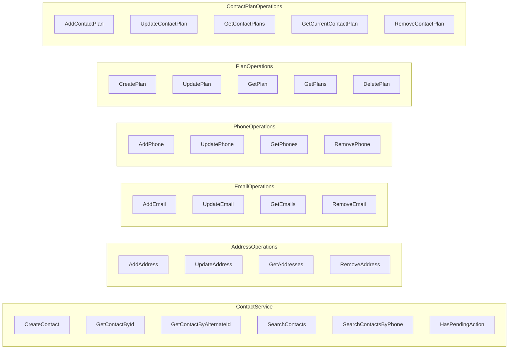

# contact-api

The main API service providing gRPC and REST endpoints for contact operations.

## Overview

This module exposes contact management functionality through gRPC (primary) and REST APIs. It handles contact creation, search, and contact information management.

## Ports

| Protocol | Port | Description |
|----------|------|-------------|
| gRPC | 9001 | Primary API interface |
| REST | 9002 | HTTP API and health endpoints |

## gRPC Endpoints



### Contact Operations

| Method | Description |
|--------|-------------|
| `CreateContact` | Create a new contact with optional pending actions |
| `GetContactById` | Retrieve contact by primary ID |
| `GetContactByAlternateId` | Retrieve contact by alternate ID (NEW_NATIONS, etc.) |
| `SearchContacts` | Search by last name (supports wildcards like "smith*") |
| `SearchContactsByPhone` | Search by phone number |
| `HasPendingAction` | Check if contact has a specific pending action |

### Plan Operations

| Method | Description |
|--------|-------------|
| `CreatePlan` | Create a new plan with carrier information |
| `UpdatePlan` | Update an existing plan |
| `GetPlan` | Retrieve a plan by ID |
| `GetPlans` | List all plans |
| `DeletePlan` | Delete a plan |

### Contact Plan Operations

| Method | Description |
|--------|-------------|
| `AddContactPlan` | Assign a plan to a contact with effective/expiration dates (UTC) |
| `UpdateContactPlan` | Update a contact's plan assignment |
| `GetContactPlans` | List all plans for a contact |
| `GetCurrentContactPlan` | Get the currently active plan for a contact |
| `RemoveContactPlan` | Remove a plan assignment from a contact |

Contact plans use ISO 8601 UTC datetime format (e.g., `2026-01-01T00:00:00Z`) for effective and expiration dates. Overlapping date ranges for the same contact are not allowed.

### Contact Operations

- **Address**: Add, Update, Get, Remove contact addresses
- **Email**: Add, Update, Get, Remove contact emails
- **Phone**: Add, Update, Get, Remove contact phones

## REST Endpoints

| Method | Path | Description |
|--------|------|-------------|
| GET | `/api/contacts/count` | Get total contact count |
| GET | `/api/contacts/search` | Search contacts by name |
| GET | `/api/contacts/by-alternate-id/{id}` | Get contact by alternate ID |
| GET | `/api/contacts/search-by-phone` | Search by phone number |
| POST | `/api/contacts/generate-alternate-ids` | Batch generate alternate IDs |

## Usage Examples

### Create Contact

```bash
grpcurl -plaintext -d '{
  "first_name": "John",
  "last_name": "Doe"
}' localhost:9001 com.geastalt.contact.grpc.ContactService/CreateContact
```

### Create Contact Without Pending Actions

```bash
grpcurl -plaintext -d '{
  "first_name": "Jane",
  "last_name": "Smith",
  "skip_generate_external_identifiers": true,
  "skip_validate_address": true
}' localhost:9001 com.geastalt.contact.grpc.ContactService/CreateContact
```

### Search Contacts

```bash
grpcurl -plaintext -d '{
  "last_name": "smith*",
  "max_results": 25
}' localhost:9001 com.geastalt.contact.grpc.ContactService/SearchContacts
```

### Check Pending Action

```bash
grpcurl -plaintext -d '{
  "contact_id": 12345,
  "action_type": "GENERATE_EXTERNAL_IDENTIFIERS"
}' localhost:9001 com.geastalt.contact.grpc.ContactService/HasPendingAction
```

### Create a Plan

```bash
grpcurl -plaintext -d '{
  "plan_name": "Gold Plan",
  "carrier_id": 1,
  "carrier_name": "Aetna"
}' localhost:9001 com.geastalt.contact.grpc.ContactService/CreatePlan
```

### Add Plan to Contact

```bash
grpcurl -plaintext -d '{
  "contact_id": 11780449,
  "plan_id": 1,
  "effective_date": "2026-01-01T00:00:00Z",
  "expiration_date": "2026-12-31T23:59:59Z"
}' localhost:9001 com.geastalt.contact.grpc.ContactService/AddContactPlan
```

### Get Current Contact Plan

```bash
grpcurl -plaintext -d '{
  "contact_id": 11780449
}' localhost:9001 com.geastalt.contact.grpc.ContactService/GetCurrentContactPlan
```

### Get All Plans

```bash
grpcurl -plaintext -d '{}' \
  localhost:9001 com.geastalt.contact.grpc.ContactService/GetPlans
```

## Configuration

Key configuration in `application.yml`:

```yaml
grpc:
  server:
    port: 9001

server:
  port: 9002

spring:
  kafka:
    bootstrap-servers: ${KAFKA_BOOTSTRAP_SERVERS:localhost:9092}

contact:
  pending-actions:
    topics:
      generate-external-identifiers: tracking.contact.ids
      validate-address: tracking.contact.address
```

## Building

```bash
# From project root
mvn clean package -DskipTests -pl contact-common,contact-api -am

# Build Docker image
docker build -f contact-api/Dockerfile -t contact-api:latest .
```

## Running

```bash
# With Maven
cd contact-api
mvn spring-boot:run

# With Java
java -jar target/contact-api-0.0.1-SNAPSHOT.jar

# With Docker
docker run -p 9001:9001 -p 9002:9002 contact-api:latest
```

## Health Endpoints

| Endpoint | Description |
|----------|-------------|
| `/actuator/health` | Overall health status |
| `/actuator/health/liveness` | Kubernetes liveness probe |
| `/actuator/health/readiness` | Kubernetes readiness probe |

## Dependencies

- `contact-common` - Shared entities and repositories
- `spring-boot-starter-web` - REST support
- `grpc-spring-boot-starter` - gRPC server
- `spring-kafka` - Kafka producer
- `opentelemetry-*` - Distributed tracing
