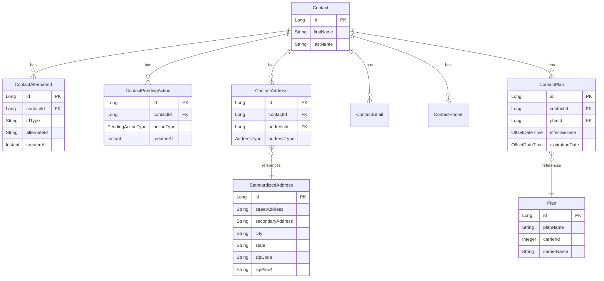

# contact-common

Shared library module containing entities, repositories, DTOs, and common services used across all Contact Service applications.

## Overview

This module is a non-executable library that provides the foundational data layer and shared business logic for the Contact Service ecosystem.

## Package Structure

```
com.geastalt.contact/
├── entity/              # JPA entities
├── repository/          # Spring Data JPA repositories
├── dto/                 # Data Transfer Objects
│   └── usps/            # USPS API DTOs
├── service/             # Shared services
├── config/              # Shared configuration
└── crypto/              # Encryption utilities
```

## Entities



## Enums and Types

### Alternate ID Types (free-form string)
Alternate ID types are free-form strings validated as Java identifiers. Types starting with `_` or `$` are reserved for internal use. Well-known types include:

| Value | Description |
|-------|-------------|
| `NEW_NATIONS` | Current FPE-generated identifier (NH + 15 digits) — default type |
| `OLD_NATIONS` | Legacy Nations identifier |
| `PAN_HASH` | PAN hash identifier |
| `CONTACT_TUPLE` | Contact tuple identifier |

Custom types can be added without code changes (e.g., `SSN_HASH`, `PARTNER_ID`). See `AlternateIdTypeValidator` for validation rules.

### PendingActionType
| Value | Description |
|-------|-------------|
| `GENERATE_EXTERNAL_IDENTIFIERS` | Generate external identifiers for the contact |
| `VALIDATE_ADDRESS` | Validate the contact's address |

### AddressType
| Value | Description |
|-------|-------------|
| `HOME` | Home address |
| `BUSINESS` | Business address |
| `MAILING` | Mailing address |

## Services

### ExternalIdService
Generates format-preserving encrypted external identifiers for contacts.

### PendingActionEventPublisher
Publishes pending action events to Kafka topics.

### AddressStandardizationService
Standardizes addresses using the USPS API.

### UspsOAuthService
Manages OAuth tokens for USPS API authentication.

## Repositories

| Repository | Entity | Key Methods |
|------------|--------|-------------|
| `ContactRepository` | Contact | `searchByName`, `searchByNamePrefix` |
| `ContactAlternateIdRepository` | ContactAlternateId | `findByIdTypeAndAlternateId`, `existsByIdTypeAndAlternateId` |
| `ContactPendingActionRepository` | ContactPendingAction | `existsByContactIdAndActionType`, `findByContactIdAndActionType` |
| `ContactAddressRepository` | ContactAddress | `findByContactId` |
| `ContactEmailRepository` | ContactEmail | `findByContactId` |
| `ContactPhoneRepository` | ContactPhone | `findByContactId` |
| `PlanRepository` | Plan | `findByCarrierId` |
| `ContactPlanRepository` | ContactPlan | `findByContactIdWithPlan`, `findCurrentPlan`, `findOverlappingPlans` |
| `StandardizedAddressRepository` | StandardizedAddress | `findByStreetAddressAndCity...` |
| `ContactSearchJdbcRepository` | - | JDBC-based search operations |

## Dependencies

```xml
<dependency>
    <groupId>org.springframework.boot</groupId>
    <artifactId>spring-boot-starter-data-jpa</artifactId>
</dependency>
<dependency>
    <groupId>org.springframework.boot</groupId>
    <artifactId>spring-boot-starter-web</artifactId>
</dependency>
<dependency>
    <groupId>org.springframework.kafka</groupId>
    <artifactId>spring-kafka</artifactId>
</dependency>
<dependency>
    <groupId>org.postgresql</groupId>
    <artifactId>postgresql</artifactId>
</dependency>
```

## Usage

Add as a dependency in other modules:

```xml
<dependency>
    <groupId>com.geastalt</groupId>
    <artifactId>contact-common</artifactId>
    <version>${project.version}</version>
</dependency>
```
