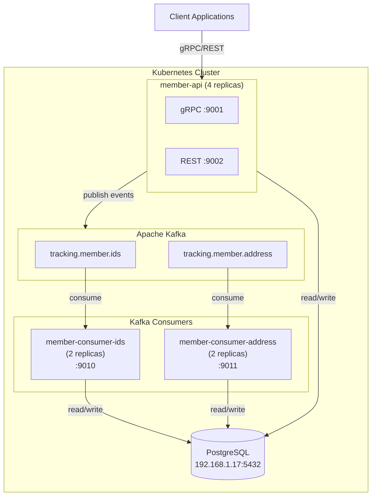
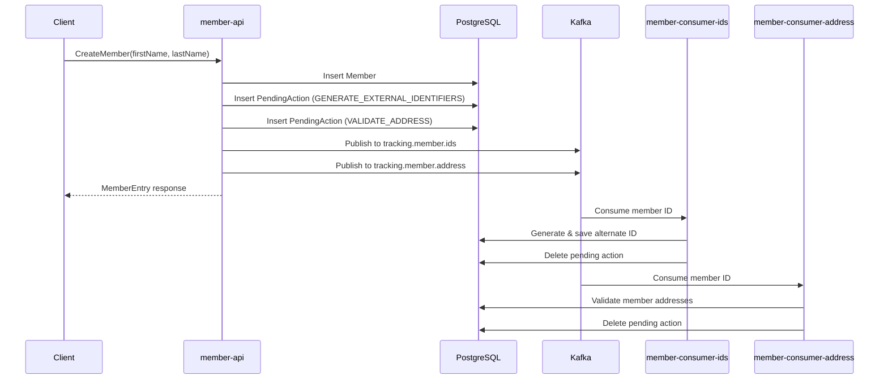

# Member Service

A multi-module Spring Boot application providing member management capabilities via gRPC and REST APIs, with Kafka-based event processing for asynchronous operations.

## Architecture



## Project Structure

```
member/
├── pom.xml                          # Parent POM
├── member-common/                   # Shared entities, repositories, services
├── member-api/                      # gRPC and REST API service
├── member-consumer-ids/             # Kafka consumer: Generate External IDs
├── member-consumer-address/         # Kafka consumer: Validate Address
├── helm/                            # Kubernetes Helm charts
│   ├── member-api/
│   ├── member-consumer-ids/
│   └── member-consumer-address/
├── k8s/                             # Kubernetes manifests
└── terraform/                       # Infrastructure as Code
```

## Modules

| Module | Description | Port |
|--------|-------------|------|
| `member-common` | Shared entities, repositories, DTOs, and services | N/A (library) |
| `member-api` | gRPC and REST API endpoints for member operations | 9001 (gRPC), 9002 (REST) |
| `member-consumer-ids` | Processes `GENERATE_EXTERNAL_IDENTIFIERS` pending actions | 9010 |
| `member-consumer-address` | Processes `VALIDATE_ADDRESS` pending actions | 9011 |

## Event Flow



## Building

```bash
# Build all modules
mvn clean package -DskipTests

# Build specific module with dependencies
mvn clean package -DskipTests -pl member-common,member-api -am
```

## Docker Images

```bash
# Build from project root
docker build -f member-api/Dockerfile -t member-api:latest .
docker build -f member-consumer-ids/Dockerfile -t member-consumer-ids:latest .
docker build -f member-consumer-address/Dockerfile -t member-consumer-address:latest .
```

## Local Development

### Prerequisites

- Java 21
- Maven
- Docker
- Minikube (for Kubernetes deployment)
- PostgreSQL database at 192.168.1.17:5432
- Kafka at localhost:9092

### Running Locally

```bash
# Start member-api
cd member-api
mvn spring-boot:run

# Start consumers (in separate terminals)
cd member-consumer-ids
mvn spring-boot:run

cd member-consumer-address
mvn spring-boot:run
```

### Testing gRPC Endpoints

```bash
# List available methods
grpcurl -plaintext localhost:9001 list com.geastalt.member.grpc.MemberService

# Create a member
grpcurl -plaintext -d '{"first_name": "John", "last_name": "Doe"}' \
  localhost:9001 com.geastalt.member.grpc.MemberService/CreateMember

# Get member by ID
grpcurl -plaintext -d '{"member_id": 11780449}' \
  localhost:9001 com.geastalt.member.grpc.MemberService/GetMemberById

# Search members
grpcurl -plaintext -d '{"last_name": "smith", "max_results": 25}' \
  localhost:9001 com.geastalt.member.grpc.MemberService/SearchMembers

# Check pending action
grpcurl -plaintext -d '{"member_id": 123, "action_type": "GENERATE_EXTERNAL_IDENTIFIERS"}' \
  localhost:9001 com.geastalt.member.grpc.MemberService/HasPendingAction

# Create a plan
grpcurl -plaintext -d '{"plan_name": "Gold Plan", "carrier_id": 1, "carrier_name": "Aetna"}' \
  localhost:9001 com.geastalt.member.grpc.MemberService/CreatePlan

# Get all plans
grpcurl -plaintext -d '{}' \
  localhost:9001 com.geastalt.member.grpc.MemberService/GetPlans

# Add plan to member (dates in ISO 8601 UTC)
grpcurl -plaintext -d '{"member_id": 11780449, "plan_id": 1, "effective_date": "2026-01-01T00:00:00Z", "expiration_date": "2026-12-31T23:59:59Z"}' \
  localhost:9001 com.geastalt.member.grpc.MemberService/AddMemberPlan

# Get current plan for a member
grpcurl -plaintext -d '{"member_id": 11780449}' \
  localhost:9001 com.geastalt.member.grpc.MemberService/GetCurrentMemberPlan
```

## Kubernetes Deployment

### Deploy Kafka

```bash
kubectl apply -f k8s/kafka.yaml
```

### Create Secrets

```bash
# For member-api
kubectl create secret generic member-api-secret \
  --from-literal=DB_PASSWORD=xxx \
  --from-literal=USPS_CLIENT_ID=xxx \
  --from-literal=USPS_CLIENT_SECRET=xxx

# For member-consumer-ids
kubectl create secret generic member-consumer-ids-secret \
  --from-literal=DB_PASSWORD=xxx \
  --from-literal=MEMBER_EXTERNAL_ID_KEY=xxx

# For member-consumer-address
kubectl create secret generic member-consumer-address-secret \
  --from-literal=DB_PASSWORD=xxx \
  --from-literal=USPS_CLIENT_ID=xxx \
  --from-literal=USPS_CLIENT_SECRET=xxx
```

### Deploy with Helm

```bash
# Build images for minikube
eval $(minikube docker-env)
docker build -f member-api/Dockerfile -t member-api:latest .
docker build -f member-consumer-ids/Dockerfile -t member-consumer-ids:latest .
docker build -f member-consumer-address/Dockerfile -t member-consumer-address:latest .

# Deploy
helm upgrade --install member-api helm/member-api
helm upgrade --install member-consumer-ids helm/member-consumer-ids
helm upgrade --install member-consumer-address helm/member-consumer-address
```

## Kafka Topics

| Topic | Purpose | Producer | Consumer |
|-------|---------|----------|----------|
| `tracking.member.ids` | Generate external identifiers | member-api | member-consumer-ids |
| `tracking.member.address` | Validate member addresses | member-api | member-consumer-address |

## Pending Actions

When a member is created, pending actions are automatically added (unless disabled via flags):

| Action Type | Description | Processed By |
|-------------|-------------|--------------|
| `GENERATE_EXTERNAL_IDENTIFIERS` | Generate NEW_NATIONS alternate ID | member-consumer-ids |
| `VALIDATE_ADDRESS` | Validate member addresses via USPS | member-consumer-address |

### CreateMember Flags

```protobuf
message CreateMemberRequest {
  string first_name = 1;
  string last_name = 2;
  bool skip_generate_external_identifiers = 3;  // Skip GENERATE_EXTERNAL_IDENTIFIERS
  bool skip_validate_address = 4;               // Skip VALIDATE_ADDRESS
}
```

## Database

- **Host**: 192.168.1.17:5432
- **Database**: member
- **Tables**:
  - `members` - Member records (~6.6M rows)
  - `member_alternate_ids` - Alternate identifiers (NEW_NATIONS, OLD_NATIONS, PAN_HASH, MEMBER_TUPLE)
  - `member_pending_actions` - Pending async actions
  - `member_addresses` - Member address associations
  - `member_emails` - Member email addresses
  - `member_phones` - Member phone numbers
  - `plans` - Plan lookup table (carrier/plan definitions)
  - `member_plans` - Member-plan associations with effective/expiration dates
  - `standardized_addresses` - USPS-standardized addresses

## Technology Stack

- **Java**: 21
- **Framework**: Spring Boot 3.4.1
- **RPC**: gRPC 1.68.1, Protocol Buffers 3.25.5
- **Database**: PostgreSQL with Spring Data JPA
- **Messaging**: Apache Kafka
- **Observability**: OpenTelemetry, Micrometer
- **Build**: Maven
- **Containerization**: Docker
- **Orchestration**: Kubernetes with Helm
