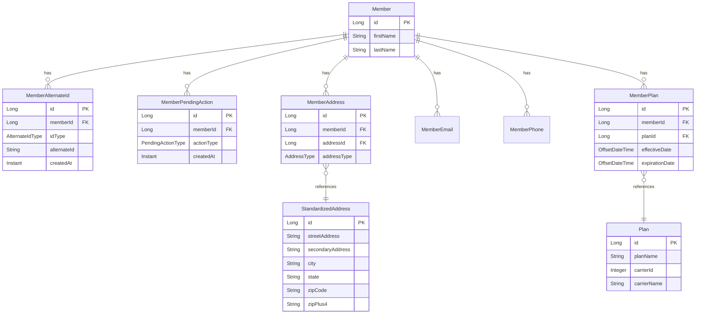

# member-common

Shared library module containing entities, repositories, DTOs, and common services used across all Member Service applications.

## Overview

This module is a non-executable library that provides the foundational data layer and shared business logic for the Member Service ecosystem.

## Package Structure

```
com.geastalt.member/
├── entity/              # JPA entities
├── repository/          # Spring Data JPA repositories
├── dto/                 # Data Transfer Objects
│   └── usps/            # USPS API DTOs
├── service/             # Shared services
├── config/              # Shared configuration
└── crypto/              # Encryption utilities
```

## Entities



## Enums

### AlternateIdType
| Value | Description |
|-------|-------------|
| `NEW_NATIONS` | Current FPE-generated identifier (NH + 15 digits) |
| `OLD_NATIONS` | Legacy Nations identifier |
| `PAN_HASH` | PAN hash identifier |
| `MEMBER_TUPLE` | Member tuple identifier |

### PendingActionType
| Value | Description |
|-------|-------------|
| `GENERATE_EXTERNAL_IDENTIFIERS` | Generate external identifiers for the member |
| `VALIDATE_ADDRESS` | Validate the member's address |

### AddressType
| Value | Description |
|-------|-------------|
| `HOME` | Home address |
| `BUSINESS` | Business address |
| `MAILING` | Mailing address |

## Services

### ExternalIdService
Generates format-preserving encrypted external identifiers for members.

### PendingActionEventPublisher
Publishes pending action events to Kafka topics.

### AddressStandardizationService
Standardizes addresses using the USPS API.

### UspsOAuthService
Manages OAuth tokens for USPS API authentication.

## Repositories

| Repository | Entity | Key Methods |
|------------|--------|-------------|
| `MemberRepository` | Member | `searchByName`, `searchByNamePrefix` |
| `MemberAlternateIdRepository` | MemberAlternateId | `findByIdTypeAndAlternateId`, `existsByIdTypeAndAlternateId` |
| `MemberPendingActionRepository` | MemberPendingAction | `existsByMemberIdAndActionType`, `findByMemberIdAndActionType` |
| `MemberAddressRepository` | MemberAddress | `findByMemberId` |
| `MemberEmailRepository` | MemberEmail | `findByMemberId` |
| `MemberPhoneRepository` | MemberPhone | `findByMemberId` |
| `PlanRepository` | Plan | `findByCarrierId` |
| `MemberPlanRepository` | MemberPlan | `findByMemberIdWithPlan`, `findCurrentPlan`, `findOverlappingPlans` |
| `StandardizedAddressRepository` | StandardizedAddress | `findByStreetAddressAndCity...` |
| `MemberSearchJdbcRepository` | - | JDBC-based search operations |

## Dependencies

```xml
<dependency>
    <groupId>org.springframework.boot</groupId>
    <artifactId>spring-boot-starter-data-jpa</artifactId>
</dependency>
<dependency>
    <groupId>org.springframework.boot</groupId>
    <artifactId>spring-boot-starter-web</artifactId>
</dependency>
<dependency>
    <groupId>org.springframework.kafka</groupId>
    <artifactId>spring-kafka</artifactId>
</dependency>
<dependency>
    <groupId>org.postgresql</groupId>
    <artifactId>postgresql</artifactId>
</dependency>
```

## Usage

Add as a dependency in other modules:

```xml
<dependency>
    <groupId>com.geastalt</groupId>
    <artifactId>member-common</artifactId>
    <version>${project.version}</version>
</dependency>
```
