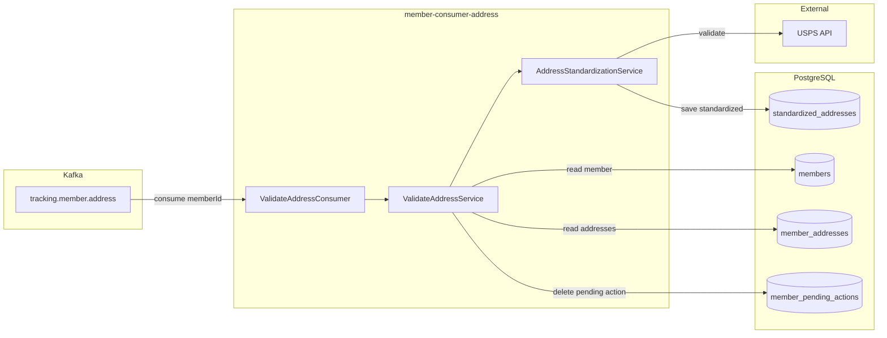
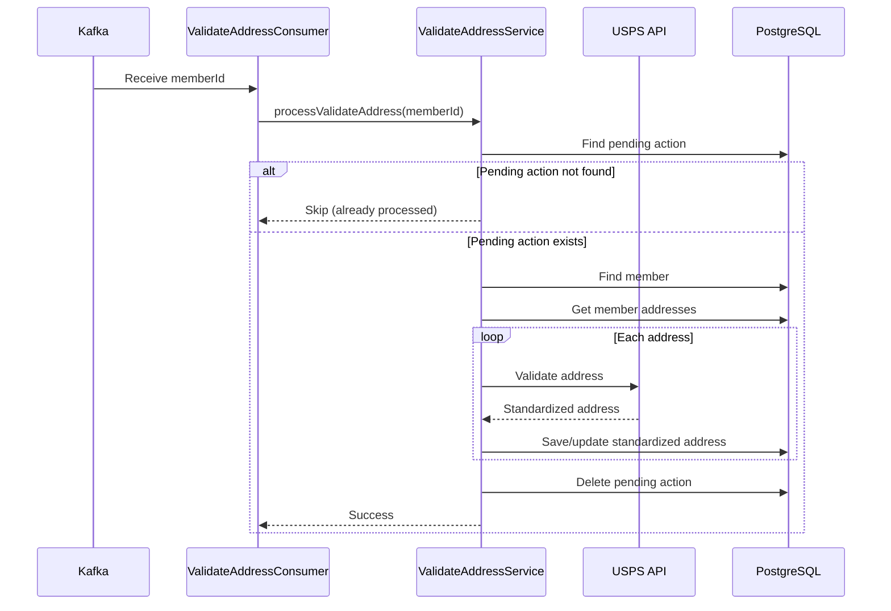
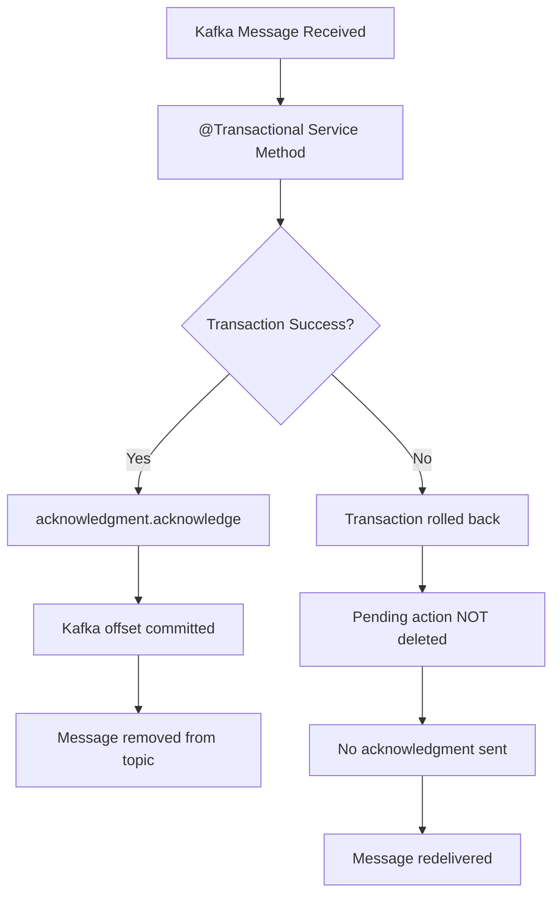

# member-consumer-address

Kafka consumer service that processes `VALIDATE_ADDRESS` pending actions.

## Overview

This service listens to the `tracking.member.address` Kafka topic and validates/standardizes addresses for newly created members using the USPS API.

## Port

| Protocol | Port | Description |
|----------|------|-------------|
| HTTP | 9011 | Health endpoints |

## Architecture



## Processing Flow



## Processing Logic

1. **Receive message** from `tracking.member.address` topic
2. **Check pending action** exists for the member
3. **Verify member** exists in database
4. **Retrieve all addresses** for the member
5. **For each address**:
   - Build USPS request from current address data
   - Call USPS API to get standardized address
   - Save standardized address (or reuse existing if identical)
   - Update member address to point to the USPS-standardized address
6. **Remove pending action** from `member_pending_actions` table

## Configuration

```yaml
spring:
  kafka:
    bootstrap-servers: ${KAFKA_BOOTSTRAP_SERVERS:localhost:9092}
    consumer:
      group-id: ${KAFKA_CONSUMER_GROUP_ID:member-consumer-address}
      auto-offset-reset: earliest
      enable-auto-commit: false
    listener:
      ack-mode: record

usps:
  base-url: ${USPS_BASE_URL:https://apis-tem.usps.com}
  client-id: ${USPS_CLIENT_ID}
  client-secret: ${USPS_CLIENT_SECRET}

member:
  pending-actions:
    topics:
      validate-address: ${PENDING_ACTION_TOPIC_VALIDATE_ADDRESS:tracking.member.address}
```

## Environment Variables

| Variable | Description | Default |
|----------|-------------|---------|
| `KAFKA_BOOTSTRAP_SERVERS` | Kafka broker addresses | `localhost:9092` |
| `KAFKA_CONSUMER_GROUP_ID` | Consumer group ID | `member-consumer-address` |
| `PENDING_ACTION_TOPIC_VALIDATE_ADDRESS` | Topic to consume | `tracking.member.address` |
| `USPS_BASE_URL` | USPS API base URL | `https://apis-tem.usps.com` |
| `USPS_CLIENT_ID` | USPS OAuth client ID | Required |
| `USPS_CLIENT_SECRET` | USPS OAuth client secret | Required |
| `DB_HOST` | Database host | `192.168.1.17` |
| `DB_PORT` | Database port | `5432` |
| `DB_NAME` | Database name | `member` |
| `DB_USERNAME` | Database username | `bob` |
| `DB_PASSWORD` | Database password | Required |

## Building

```bash
# From project root
mvn clean package -DskipTests -pl member-common,member-consumer-address -am

# Build Docker image
docker build -f member-consumer-address/Dockerfile -t member-consumer-address:latest .
```

## Running

```bash
# With Maven
cd member-consumer-address
mvn spring-boot:run

# With Java
java -jar target/member-consumer-address-0.0.1-SNAPSHOT.jar

# With Docker
docker run -p 9011:9011 \
  -e KAFKA_BOOTSTRAP_SERVERS=kafka:9092 \
  -e USPS_CLIENT_ID=your-client-id \
  -e USPS_CLIENT_SECRET=your-client-secret \
  -e DB_PASSWORD=your-password \
  member-consumer-address:latest
```

## Health Endpoints

| Endpoint | Description |
|----------|-------------|
| `/actuator/health` | Overall health status |
| `/actuator/health/liveness` | Kubernetes liveness probe |
| `/actuator/health/readiness` | Kubernetes readiness probe |

## Scaling

- Default: 2 replicas in Kubernetes
- Kafka partitions determine max parallelism
- Each replica joins the same consumer group for load balancing
- Consider USPS API rate limits when scaling

## Transaction & Acknowledgment Flow



The pending action deletion occurs within the `@Transactional` boundary:

1. **Success path**: All DB changes (including pending action deletion) commit atomically, then Kafka offset is acknowledged
2. **Failure path**: Transaction rolls back (pending action remains), message is not acknowledged and will be redelivered

## Error Handling

- Failed messages are retried automatically by Spring Kafka
- USPS API failures trigger token refresh and retry
- Persistent failures should be routed to a dead-letter topic (DLQ)
- Individual address failures don't block processing of other addresses

## USPS Integration

The service uses the USPS Web Tools API for address standardization:

- **OAuth Authentication**: Tokens are cached and refreshed automatically
- **Address Validation**: Corrects and standardizes addresses
- **Deduplication**: Existing standardized addresses are reused
