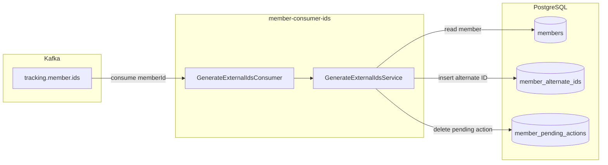
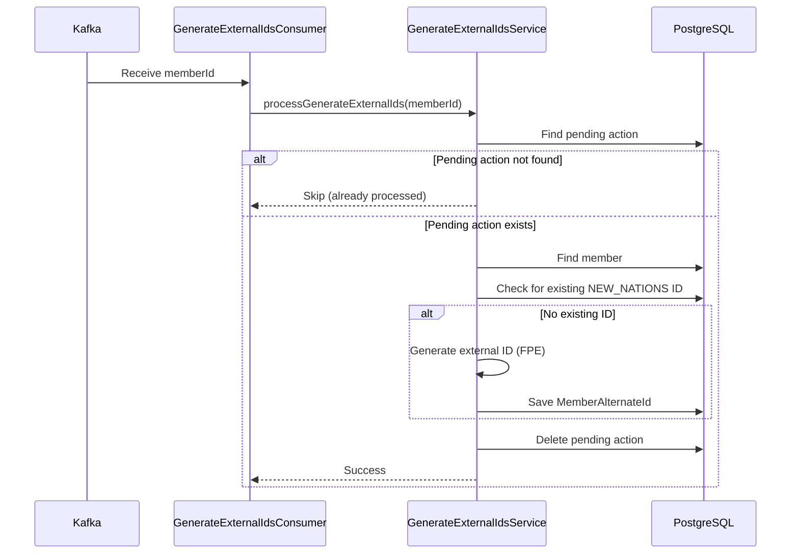
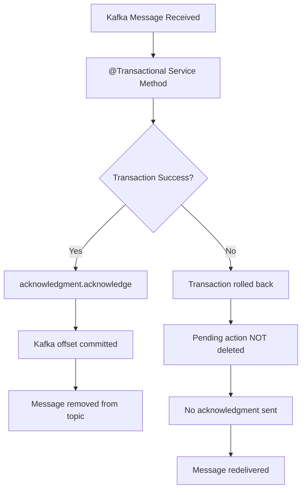

# member-consumer-ids

Kafka consumer service that processes `GENERATE_EXTERNAL_IDENTIFIERS` pending actions.

## Overview

This service listens to the `tracking.member.ids` Kafka topic and generates external identifiers (NEW_NATIONS alternate IDs) for newly created members.

## Port

| Protocol | Port | Description |
|----------|------|-------------|
| HTTP | 9010 | Health endpoints |

## Architecture



## Processing Flow



## Processing Logic

1. **Receive message** from `tracking.member.ids` topic
2. **Check pending action** exists for the member
3. **Verify member** exists in database
4. **Check for existing** NEW_NATIONS alternate ID
5. **Generate ID** using format-preserving encryption (if needed)
6. **Save alternate ID** to `member_alternate_ids` table
7. **Remove pending action** from `member_pending_actions` table

## Configuration

```yaml
spring:
  kafka:
    bootstrap-servers: ${KAFKA_BOOTSTRAP_SERVERS:localhost:9092}
    consumer:
      group-id: ${KAFKA_CONSUMER_GROUP_ID:member-consumer-ids}
      auto-offset-reset: earliest
      enable-auto-commit: false
    listener:
      ack-mode: record

member:
  external-id:
    encryption-key: ${MEMBER_EXTERNAL_ID_KEY}
  pending-actions:
    topics:
      generate-external-identifiers: ${PENDING_ACTION_TOPIC_GENERATE_IDS:tracking.member.ids}
```

## Environment Variables

| Variable | Description | Default |
|----------|-------------|---------|
| `KAFKA_BOOTSTRAP_SERVERS` | Kafka broker addresses | `localhost:9092` |
| `KAFKA_CONSUMER_GROUP_ID` | Consumer group ID | `member-consumer-ids` |
| `PENDING_ACTION_TOPIC_GENERATE_IDS` | Topic to consume | `tracking.member.ids` |
| `MEMBER_EXTERNAL_ID_KEY` | Encryption key for ID generation | Required |
| `DB_HOST` | Database host | `192.168.1.17` |
| `DB_PORT` | Database port | `5432` |
| `DB_NAME` | Database name | `member` |
| `DB_USERNAME` | Database username | `bob` |
| `DB_PASSWORD` | Database password | Required |

## Building

```bash
# From project root
mvn clean package -DskipTests -pl member-common,member-consumer-ids -am

# Build Docker image
docker build -f member-consumer-ids/Dockerfile -t member-consumer-ids:latest .
```

## Running

```bash
# With Maven
cd member-consumer-ids
mvn spring-boot:run

# With Java
java -jar target/member-consumer-ids-0.0.1-SNAPSHOT.jar

# With Docker
docker run -p 9010:9010 \
  -e KAFKA_BOOTSTRAP_SERVERS=kafka:9092 \
  -e MEMBER_EXTERNAL_ID_KEY=your-key \
  -e DB_PASSWORD=your-password \
  member-consumer-ids:latest
```

## Health Endpoints

| Endpoint | Description |
|----------|-------------|
| `/actuator/health` | Overall health status |
| `/actuator/health/liveness` | Kubernetes liveness probe |
| `/actuator/health/readiness` | Kubernetes readiness probe |

## Scaling

- Default: 2 replicas in Kubernetes
- Kafka partitions determine max parallelism
- Each replica joins the same consumer group for load balancing

## Transaction & Acknowledgment Flow



The pending action deletion occurs within the `@Transactional` boundary:

1. **Success path**: All DB changes (including pending action deletion) commit atomically, then Kafka offset is acknowledged
2. **Failure path**: Transaction rolls back (pending action remains), message is not acknowledged and will be redelivered

## Error Handling

- Failed messages are retried automatically by Spring Kafka
- Persistent failures should be routed to a dead-letter topic (DLQ)
- Idempotent processing: checks for existing alternate ID before creating
